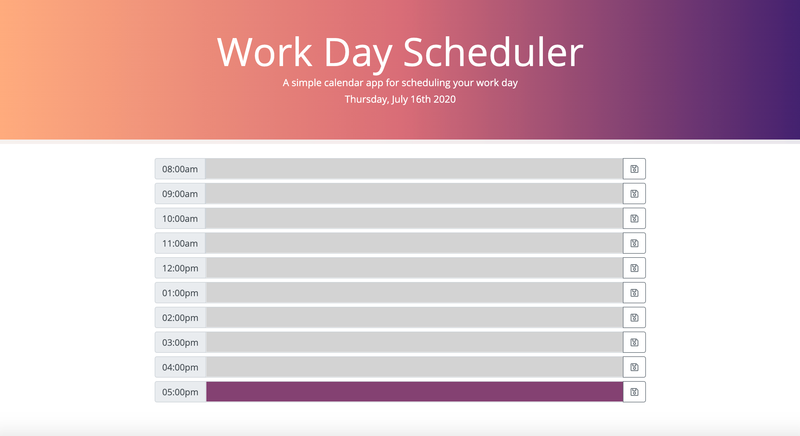

# Work-Day-Scheduler
Work-Day-Scheduler is an interactive application that allows users to organize their daily work tasks by the hour.

## Description
Upon entering the applciation, users are greeted with a polished UI featuring a work-day calendar spanning from the hours 8am - 5pm. The header of the application utilizes moment.js to display the current date,and each timeslot in the calendar has input capabilities where users can assign tasks for each hour of the work day. 

Additionally, the timeslots are color-coded based on the time of day the user is accessing the application. Specifically: 

    1. grey signifies past timeslot(s)
    2. purple signifies current timeslot
    3. Pink signifies future timeslot(s)

Finally, users have the ability to save their tasks to the page by clicking the save button at the end of each timeslot. 

## Visuals

## Link to Deployed Application
https://barrettpope.github.io/Work-Day-Scheduler/

## Support
For questions, comments or concerns regarding the Work-Day-Scheduler application, please email barrettpope94@gmail.com.

## Contributing
Pull requests are welcome.
